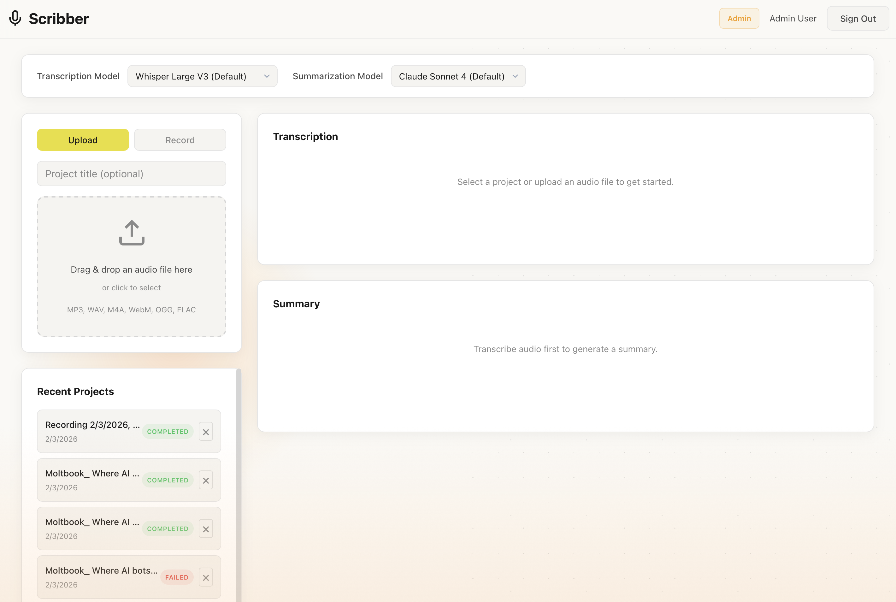
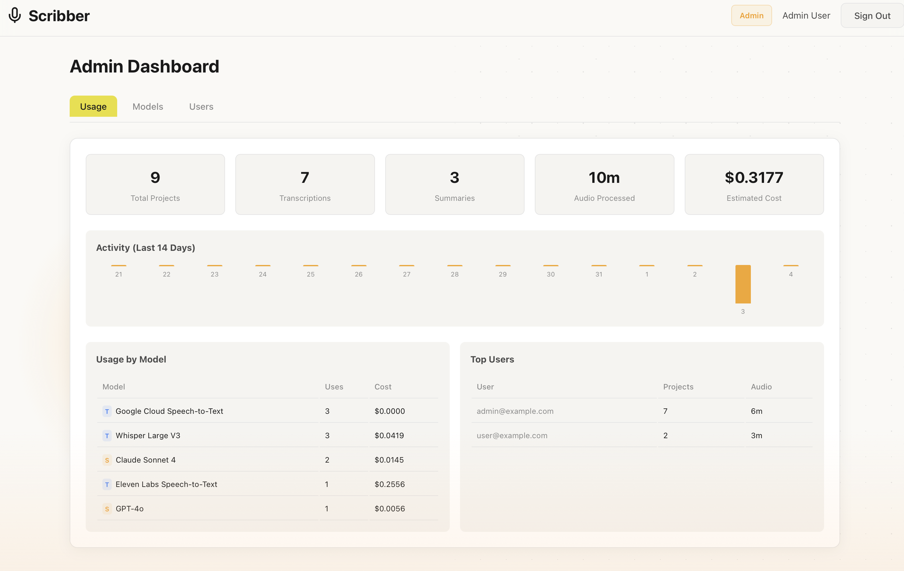
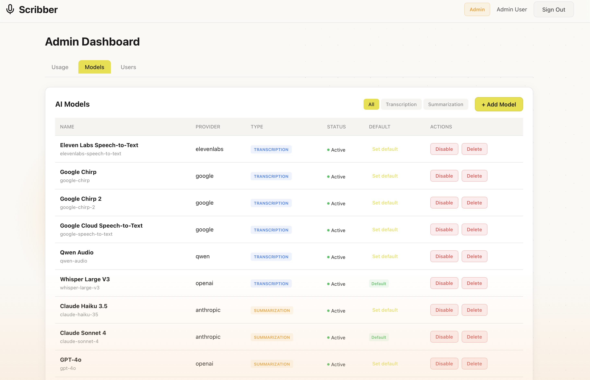

# Scribber

**Scribber** is a professional audio transcription and summarization application that supports multiple AI providers. Upload or record audio, transcribe it using your choice of speech-to-text models, and generate intelligent summaries with leading LLMs.

## Screenshots

### Main Dashboard
Upload or record audio, select your preferred AI models, and get transcriptions with summaries.



### Admin Dashboard - Usage Analytics
Monitor usage statistics, costs, activity trends, and top users.



### Admin Dashboard - Model Management
Configure and manage transcription and summarization AI models.



### Admin Dashboard - User Management
Manage users, roles, and permissions.


## Features

- **Multi-Provider Transcription**: Choose from multiple speech-to-text engines:
  - OpenAI Whisper (Large V3)
  - Google Cloud Speech-to-Text V1 & V2 (Chirp)
  - ElevenLabs Scribe
  - Qwen Audio

- **AI-Powered Summarization**: Generate summaries using:
  - Anthropic Claude (Sonnet, Opus)
  - OpenAI GPT-4o / GPT-4o-mini
  - Google Vertex AI (Gemini 1.5 Flash/Pro)

- **Flexible Audio Input**:
  - Drag-and-drop file upload
  - Browser-based audio recording
  - Supports MP3, WAV, M4A, WebM, OGG, FLAC, MP4

- **Real-Time Processing**: WebSocket-based status updates during transcription and summarization

- **Export Options**: Send results to Google Drive, Email, or WhatsApp

- **Admin Dashboard**: Manage AI models, users, and monitor usage statistics

## Architecture

| Component | Technology |
|-----------|------------|
| Backend | FastAPI (Python 3.12) + SQLAlchemy Async |
| Frontend | React 18 + Vite |
| Database | PostgreSQL 16 |
| Task Queue | Celery + Redis |
| Real-time | WebSockets |
| Proxy | Caddy (auto SSL) |

## Project Structure

```
scribber/
├── backend/
│   ├── app/
│   │   ├── main.py                 # FastAPI application
│   │   ├── config.py               # Settings management
│   │   ├── database.py             # Async SQLAlchemy setup
│   │   ├── worker.py               # Celery worker
│   │   ├── models/                 # Database models
│   │   │   ├── user.py             # User with admin role
│   │   │   ├── project.py          # Audio projects
│   │   │   ├── model_config.py     # AI model configurations
│   │   │   └── usage_log.py        # Usage tracking
│   │   ├── routers/
│   │   │   ├── auth.py             # Authentication (JWT)
│   │   │   ├── projects.py         # Project CRUD + transcribe/summarize
│   │   │   ├── models.py           # List available AI models
│   │   │   ├── export.py           # Export to Drive/Email
│   │   │   ├── websocket.py        # Real-time updates
│   │   │   └── admin/              # Admin endpoints
│   │   ├── services/
│   │   │   ├── storage.py          # File storage service
│   │   │   ├── google_auth.py      # Google Cloud authentication
│   │   │   ├── transcription/      # STT providers
│   │   │   │   ├── whisper.py      # OpenAI Whisper
│   │   │   │   ├── google_stt.py   # Google STT V1
│   │   │   │   ├── google_stt_v2.py # Google STT V2 (Chirp)
│   │   │   │   ├── elevenlabs.py   # ElevenLabs Scribe
│   │   │   │   └── qwen.py         # Qwen Audio
│   │   │   ├── summarization/      # LLM providers
│   │   │   │   ├── anthropic_service.py # Claude
│   │   │   │   ├── openai_service.py    # GPT-4
│   │   │   │   └── vertex_service.py    # Gemini
│   │   │   └── export/             # Export services
│   │   └── tasks/                  # Celery background tasks
│   ├── alembic/                    # Database migrations
│   ├── Dockerfile
│   └── requirements.txt
│
├── frontend/
│   ├── src/
│   │   ├── App.jsx
│   │   ├── pages/
│   │   │   ├── DashboardPage.jsx   # Main workspace
│   │   │   ├── AdminPage.jsx       # Admin dashboard
│   │   │   ├── SignInPage.jsx
│   │   │   └── SignUpPage.jsx
│   │   ├── components/
│   │   │   ├── AudioRecorder.jsx   # Browser recording
│   │   │   ├── ProcessingStatus.jsx
│   │   │   └── Layout.jsx
│   │   ├── hooks/
│   │   │   ├── useProjects.js
│   │   │   ├── useModels.js
│   │   │   ├── useWebSocket.js
│   │   │   └── useExport.js
│   │   └── context/
│   │       └── AuthContext.jsx
│   ├── Dockerfile
│   └── package.json
│
├── infra/
│   └── single-vm/                  # Production deployment
│       ├── docker-compose.yml
│       ├── caddy/Caddyfile
│       └── scripts/
│
├── docker-compose.yml              # Local development
├── .env.example
└── README.md
```

## Quick Start

### Prerequisites

- Docker and Docker Compose
- API keys for at least one transcription and one summarization provider

### Local Development

1. **Clone and configure:**
   ```bash
   git clone <repo-url>
   cd scribber
   cp .env.example .env
   ```

2. **Edit `.env` with your API keys:**
   ```bash
   # Required: At least one transcription provider
   OPENAI_API_KEY=sk-...           # For Whisper
   ELEVENLABS_API_KEY=sk_...       # For ElevenLabs Scribe

   # Required: At least one summarization provider
   ANTHROPIC_API_KEY=sk-ant-...    # For Claude

   # Optional: Google Cloud (for Chirp and Gemini)
   GOOGLE_SERVICE_ACCOUNT_JSON={"type":"service_account",...}
   GOOGLE_CLOUD_PROJECT=your-project-id
   VERTEX_AI_LOCATION=europe-west4
   GOOGLE_STT_LOCATION=europe-west4
   ```

3. **Start all services:**
   ```bash
   docker compose up -d
   ```

4. **Run database migrations:**
   ```bash
   docker compose exec backend alembic upgrade head
   ```

5. **Access the application:**
   - Frontend: http://localhost:5173
   - Backend API: http://localhost:8000
   - API Docs: http://localhost:8000/docs

6. **Create an account** and start transcribing!

### Development Commands

```bash
# Start all services
docker compose up -d

# View logs
docker compose logs -f
docker compose logs -f celery-worker    # Background tasks
docker compose logs -f backend          # API server

# Restart after code changes
docker compose restart backend celery-worker

# Rebuild containers
docker compose up -d --build

# Stop all services
docker compose down

# Database operations
docker compose exec backend alembic upgrade head     # Run migrations
docker compose exec backend alembic revision -m "description" --autogenerate
docker compose exec postgres psql -U appuser -d app_db

# Optional tools (pgAdmin, Flower)
docker compose --profile tools up -d
```

### Services

| Service | Port | Description |
|---------|------|-------------|
| frontend | 5173 | React dashboard |
| backend | 8000 | FastAPI server |
| postgres | 5432 | PostgreSQL database |
| redis | 6379 | Celery message broker |
| celery-worker | - | Background task processor |
| pgadmin | 5050 | Database admin (profile: tools) |
| flower | 5555 | Celery monitoring (profile: tools) |

## API Endpoints

### Projects
| Endpoint | Method | Description |
|----------|--------|-------------|
| `/api/v1/projects` | GET | List user's projects |
| `/api/v1/projects` | POST | Create project (upload audio) |
| `/api/v1/projects/{id}` | GET | Get project details |
| `/api/v1/projects/{id}` | PUT | Update project |
| `/api/v1/projects/{id}` | DELETE | Delete project |
| `/api/v1/projects/{id}/transcribe` | POST | Start transcription |
| `/api/v1/projects/{id}/summarize` | POST | Generate summary |
| `/api/v1/projects/{id}/status` | GET | Get processing status |

### Models
| Endpoint | Method | Description |
|----------|--------|-------------|
| `/api/v1/models` | GET | List active AI models |
| `/api/v1/models/transcription` | GET | List transcription models |
| `/api/v1/models/summarization` | GET | List summarization models |

### Export
| Endpoint | Method | Description |
|----------|--------|-------------|
| `/api/v1/export/google-drive` | POST | Export to Google Drive |
| `/api/v1/export/email` | POST | Send via email |

### Admin (requires admin role)
| Endpoint | Method | Description |
|----------|--------|-------------|
| `/api/v1/admin/models` | GET/POST | Manage AI models |
| `/api/v1/admin/users` | GET | List users |
| `/api/v1/admin/usage` | GET | Usage statistics |

### WebSocket
| Endpoint | Description |
|----------|-------------|
| `/api/v1/ws/projects/{id}` | Real-time project status updates |

## Environment Variables

### Required
| Variable | Description |
|----------|-------------|
| `SECRET_KEY` | JWT signing key (`openssl rand -base64 64`) |
| `POSTGRES_PASSWORD` | Database password |

### AI Providers (configure at least one of each type)

**Transcription:**
| Variable | Provider |
|----------|----------|
| `OPENAI_API_KEY` | OpenAI Whisper |
| `ELEVENLABS_API_KEY` | ElevenLabs Scribe |
| `GOOGLE_SERVICE_ACCOUNT_JSON` | Google Cloud STT |

**Summarization:**
| Variable | Provider |
|----------|----------|
| `ANTHROPIC_API_KEY` | Claude |
| `OPENAI_API_KEY` | GPT-4 |
| `GOOGLE_SERVICE_ACCOUNT_JSON` | Gemini (Vertex AI) |

### Google Cloud Configuration
| Variable | Default | Description |
|----------|---------|-------------|
| `GOOGLE_CLOUD_PROJECT` | - | GCP project ID |
| `GOOGLE_SERVICE_ACCOUNT_JSON` | - | Service account JSON |
| `VERTEX_AI_LOCATION` | `us-central1` | Gemini region |
| `GOOGLE_STT_LOCATION` | `europe-west4` | Chirp region* |

*Chirp models available in: `us-central1`, `europe-west4`, `asia-southeast1`

### Application
| Variable | Default | Description |
|----------|---------|-------------|
| `ENVIRONMENT` | `development` | Environment mode |
| `DEBUG` | `false` | Debug mode |
| `UPLOAD_DIR` | `/app/uploads` | Audio storage path |
| `MAX_UPLOAD_SIZE_MB` | `500` | Max file size |
| `CORS_ALLOWED_ORIGINS` | `localhost:5173` | CORS origins |

## Production Deployment

### Single VM Deployment

1. **SSH to your VM:**
   ```bash
   ssh user@your-vm-ip
   git clone <repo-url>
   cd scribber
   ```

2. **Install Docker (if needed):**
   ```bash
   sudo ./infra/single-vm/scripts/install-docker.sh
   ```

3. **Configure environment:**
   ```bash
   cd infra/single-vm
   cp .env.example .env
   nano .env  # Add your API keys and settings
   ```

4. **Deploy:**
   ```bash
   ./scripts/deploy.sh
   ```

5. **Management commands:**
   ```bash
   ./scripts/manage.sh status     # Check status
   ./scripts/manage.sh logs       # View logs
   ./scripts/manage.sh health     # Health check
   ./scripts/manage.sh backup     # Backup database
   ./scripts/manage.sh update     # Pull and redeploy
   ```

## Supported AI Models

### Transcription Models

| Provider | Model | Notes |
|----------|-------|-------|
| OpenAI | Whisper Large V3 | Best overall accuracy |
| Google | Chirp (V2) | Low word error rate, requires `europe-west4` or `us-central1` |
| Google | Speech-to-Text V1 | Legacy, broader language support |
| ElevenLabs | Scribe V1/V2 | Fast processing |
| Qwen | Qwen Audio | Multilingual support |

### Summarization Models

| Provider | Model | Notes |
|----------|-------|-------|
| Anthropic | Claude Sonnet 4 | Excellent summarization quality |
| Anthropic | Claude Opus 4 | Highest quality, slower |
| OpenAI | GPT-4o | Fast, good quality |
| OpenAI | GPT-4o-mini | Budget option |
| Google | Gemini 1.5 Flash | Fast, cost-effective |
| Google | Gemini 1.5 Pro | Higher quality |

## Security Notes

1. **Generate secure keys:**
   ```bash
   openssl rand -base64 64
   ```

2. **Never commit `.env` files** - they contain API keys

3. **Use HTTPS in production** - Caddy handles this automatically

4. **Rotate API keys regularly**

5. **Passwords are hashed with bcrypt**

## License

MIT
